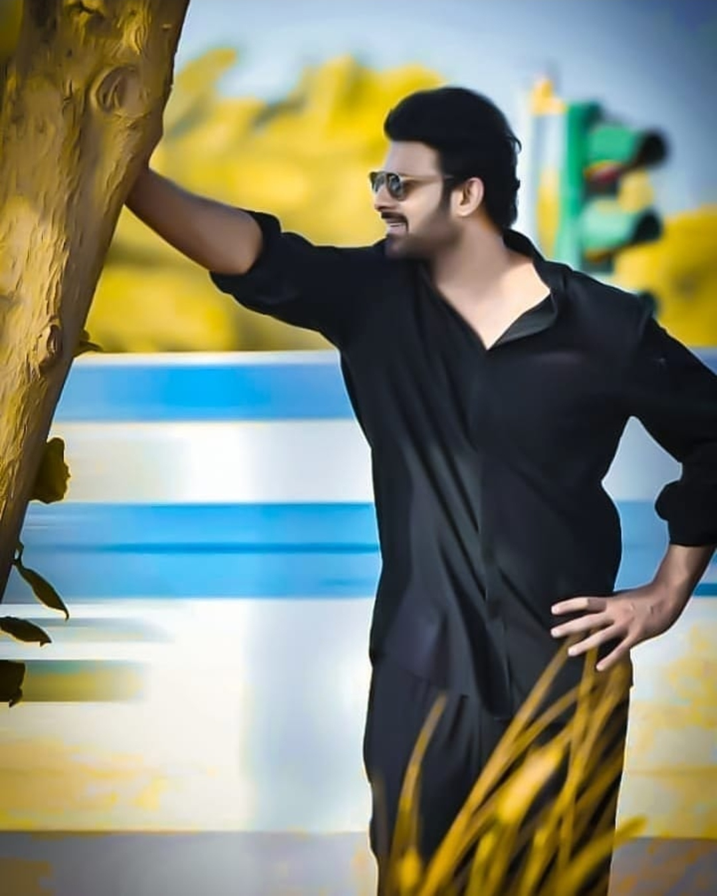
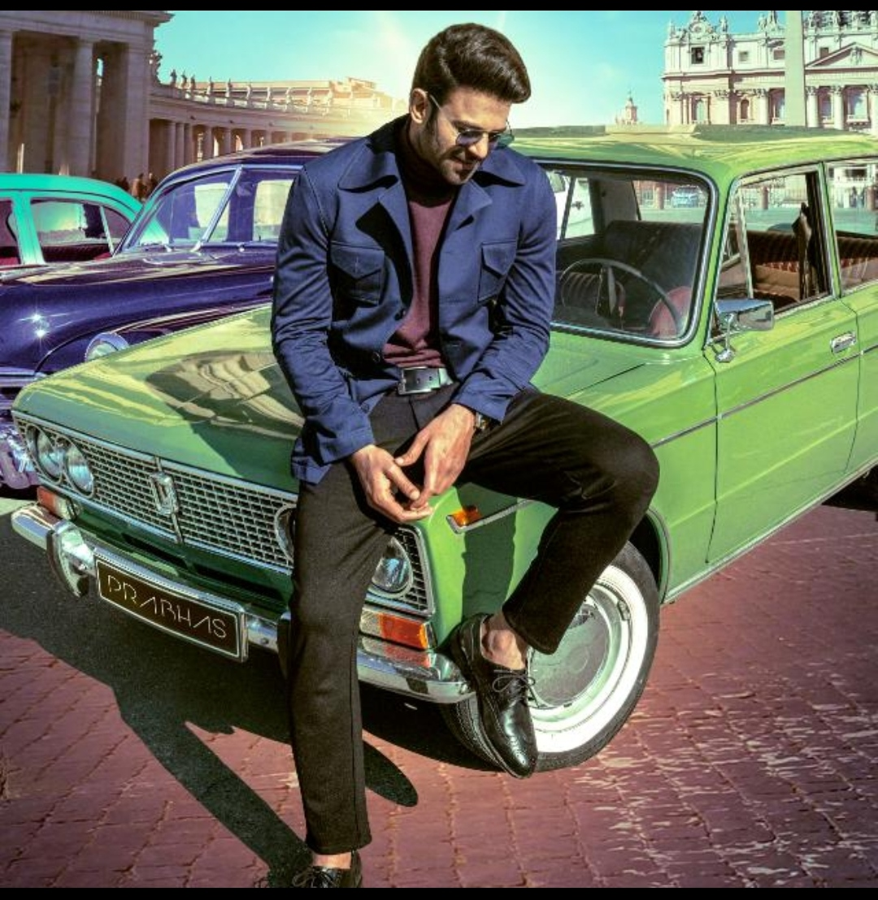
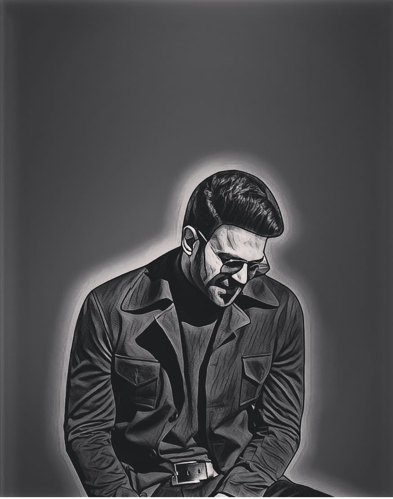

# Welcome to my website!

Uppalapati Venkata Suryanarayana Prabhas Raju (born 23 October   1979), known mononymously as Prabhas, is an Indian actor who   works predominantly in Telugu films. Prabhas made his screen debut with the 2002 Telugu action drama film Eeswar. He has garnered the state Nandi Award for Best Actor, for his role in Mirchi.[4][5] Prabhas is the first south Indian actor to have his wax sculpture at Madame Tussaud's wax museum.[6]

